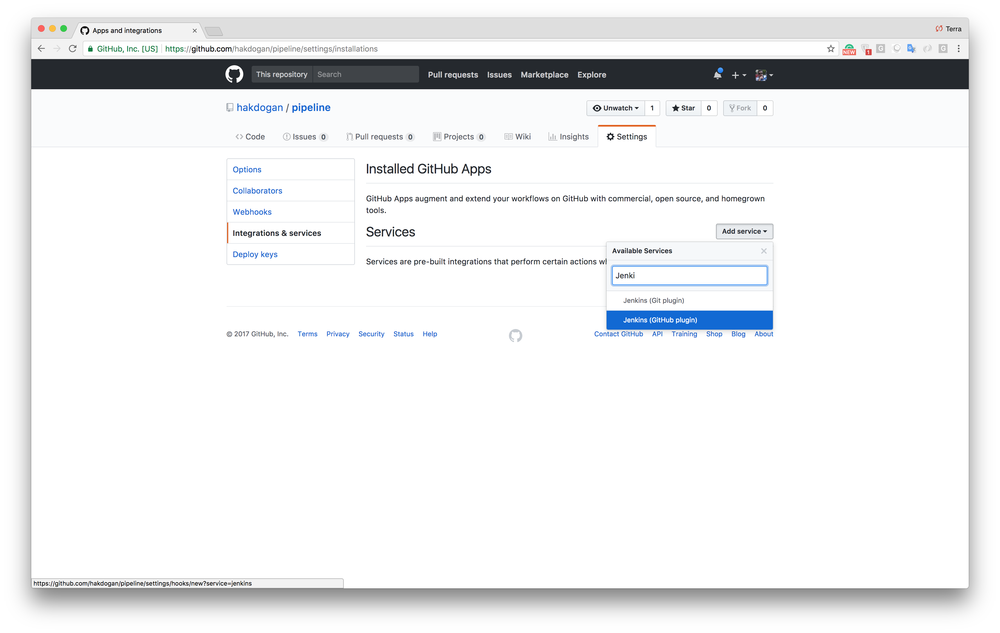
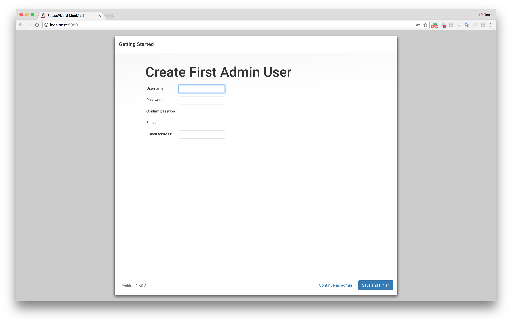
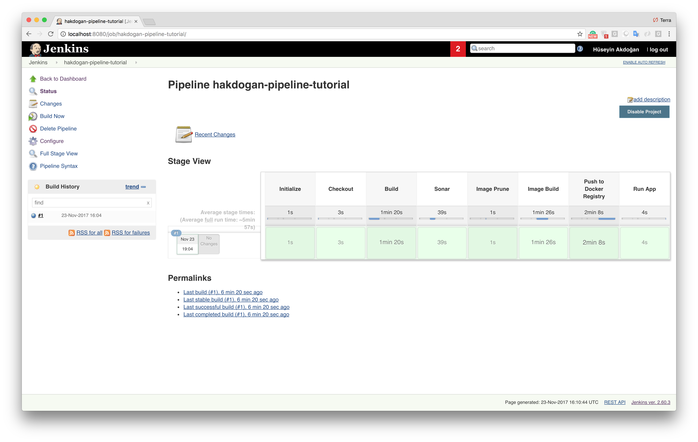

# A tutorial about Continuous Integration and Continuous Delivery by Dockerize Jenkins Pipeline

This repository is a tutorial it tries to exemplify how to automatically manage the process of building, testing with the highest coverage, and deployment phases.

Our goal is to ensure our pipeline works well after each code being pushed. The processes we want to auto-manage:
* Code checkout
* Run tests
* Compile the code
* Run Sonarqube analysis on the code
* Create Docker image
* Push the image to Docker Hub
* Pull and run the image

echo 'vm.max_map_count=262144' >> /etc/sysctl.conf
sysctl -p

## First step, running up the services

Since one of the goals is to obtain the ``sonarqube`` report of our project, we should be able to access sonarqube from the jenkins service. ``Docker compose`` is a best choice to run services working together. We configure our application services in a yaml file as below.

``docker-compose.yml``
```yml
version: '3.2'
services:
  sonarqube:
    build:
      context: sonarqube/
    ports:
      - 9000:9000
      - 9092:9092
    container_name: sonarqube
  jenkins:
    build:
      context: jenkins/
    privileged: true
    user: root
    ports:
      - 8080:8080
      - 50000:50000
    container_name: jenkins
    volumes:
      - /tmp/jenkins:/var/jenkins_home #Remember that, the tmp directory is designed to be wiped on system reboot.
      - /var/run/docker.sock:/var/run/docker.sock
    depends_on:
      - sonarqube
```

Paths of docker files of the containers are specified at context attribute in the docker-compose file. Content of these files as follows.

``sonarqube/Dockerfile``
```
FROM sonarqube:6.7-alpine
```

``jenkins/Dockerfile``
```
FROM jenkins:2.60.3
```

If we run the following command in the same directory as the ``docker-compose.yml`` file, the Sonarqube and Jenkins containers will up and run.

```
docker-compose -f docker-compose.yml up --build
```

```
docker ps

CONTAINER ID        IMAGE                COMMAND                  CREATED              STATUS              PORTS                                              NAMES
87105432d655        pipeline_jenkins     "/bin/tini -- /usr..."   About a minute ago   Up About a minute   0.0.0.0:8080->8080/tcp, 0.0.0.0:50000->50000/tcp   jenkins
f5bed5ba3266        pipeline_sonarqube   "./bin/run.sh"           About a minute ago   Up About a minute   0.0.0.0:9000->9000/tcp, 0.0.0.0:9092->9092/tcp     sonarqube
```

## GitHub configuration
We’ll define a service on Github to call the ``Jenkins Github webhook`` because we want to trigger the pipeline. To do this go to _Settings -> Integrations & services._ The ``Jenkins Github plugin`` should be shown on the list of available services as below.



After this, we should add a new service by typing the URL of the dockerized Jenkins container along with the ``/github-webhook/`` path.


The next step is that create an ``SSH key`` for a Jenkins user and define it as ``Deploy keys`` on our GitHub repository.


If everything goes well, the following connection request should return with a success.
```
ssh git@github.com
PTY allocation request failed on channel 0
Hi <your github username>/<repository name>! You've successfully authenticated, but GitHub does not provide shell access.
Connection to github.com closed.
```

## Jenkins configuration

We have configured Jenkins in the docker compose file to run on port 8080 therefore if we visit http://localhost:8080 we will be greeted with a screen like this.


We need the admin password to proceed to installation. It’s stored in the ``/var/jenkins_home/secrets/initialAdminPassword`` directory and also It’s written as output on the console when Jenkins starts.

```
jenkins      | *************************************************************
jenkins      |
jenkins      | Jenkins initial setup is required. An admin user has been created and a password generated.
jenkins      | Please use the following password to proceed to installation:
jenkins      |
jenkins      | 45638c79cecd4f43962da2933980197e
jenkins      |
jenkins      | This may also be found at: /var/jenkins_home/secrets/initialAdminPassword
jenkins      |
jenkins      | *************************************************************
```

To access the password from the container.

```
docker exec -it jenkins sh
/ $ cat /var/jenkins_home/secrets/initialAdminPassword
```

After entering the password, we will download recommended plugins and define an ``admin user``.




After clicking **Save and Finish** and **Start using Jenkins** buttons, we should be seeing the Jenkins homepage. One of the seven goals listed above is that we must have the ability to build an image in the Jenkins being dockerized. Take a look at the volume definitions of the Jenkins service in the compose file.
```
- /var/run/docker.sock:/var/run/docker.sock
```

The purpose is to communicate between the ``Docker Daemon`` and the ``Docker Client``(_we will install it on Jenkins_) over the socket. Like the docker client, we also need ``Maven`` to compile the application. For the installation of these tools, we need to perform the ``Maven`` and ``Docker Client`` configurations under _Manage Jenkins -> Global Tool Configuration_ menu.


We have added the ``Maven and Docker installers`` and have checked the ``Install automatically`` checkbox. These tools are installed by Jenkins when our script([Jenkins file](https://github.com/hakdogan/jenkins-pipeline/blob/master/Jenkinsfile)) first runs. We give ``myMaven`` and ``myDocker`` names to the tools. We will access these tools with this names in the script file.

Since we will perform some operations such as ``checkout codebase`` and ``pushing an image to Docker Hub``, we need to define the ``Docker Hub Credentials``. Keep in mind that if we are using a **private repo**, we must define ``Github credentials``. These definitions are performed under _Jenkins Home Page -> Credentials -> Global credentials (unrestricted) -> Add Credentials_ menu.


We use the value we entered in the ``ID`` field to Docker Login in the script file. Now, we define pipeline under _Jenkins Home Page -> New Item_ menu.


In this step, we select ``GitHub hook trigger for GITScm pooling`` options for automatic run of the pipeline by ``Github hook`` call.


Also in the Pipeline section, we select the ``Pipeline script from SCM`` as Definition, define the GitHub repository and the branch name, and specify the script location (_[Jenkins file](https://github.com/hakdogan/jenkins-pipeline/blob/master/Jenkinsfile)_).


After that, when a push is done to the remote repository or when you manually trigger the pipeline by ``Build Now`` option, the steps described in Jenkins file will be executed.



## Review important points of the Jenkins file

```
stage('Initialize'){
    def dockerHome = tool 'myDocker'
    def mavenHome  = tool 'myMaven'
    env.PATH = "${dockerHome}/bin:${mavenHome}/bin:${env.PATH}"
}
```

The ``Maven`` and ``Docker client`` tools we have defined in Jenkins under _Global Tool Configuration_ menu are added to the ``PATH environment variable`` for using these tools with ``sh command``.

```
stage('Push to Docker Registry'){
    withCredentials([usernamePassword(credentialsId: 'dockerHubAccount', usernameVariable: 'USERNAME', passwordVariable: 'PASSWORD')]) {
        pushToImage(CONTAINER_NAME, CONTAINER_TAG, USERNAME, PASSWORD)
    }
}
```

``withCredentials`` provided by ``Jenkins Credentials Binding Plugin`` and bind credentials to variables. We passed **dockerHubAccount** value with ``credentialsId`` parameter. Remember that, dockerHubAccount value is Docker Hub credentials ID we have defined it under _Jenkins Home Page -> Credentials -> Global credentials (unrestricted) -> Add Credentials_ menu. In this way, we access to the username and password information of the account for login.

## Sonarqube configuration

For ``Sonarqube`` we have made the following definitions in the ``pom.xml`` file of the project.

```xml
<sonar.host.url>http://sonarqube:9000</sonar.host.url>
...
<dependencies>
...
    <dependency>
        <groupId>org.codehaus.mojo</groupId>
        <artifactId>sonar-maven-plugin</artifactId>
        <version>2.7.1</version>
        <type>maven-plugin</type>
    </dependency>
...
</dependencies>
```

In the docker compose file, we gave the name of the Sonarqube service which is ``sonarqube``, this is why in the ``pom.xml`` file, the sonar URL was defined as http://sonarqube:9000.
=======
# jenkins-sonaqube-pipeline


Example Jenkins config.xml
<?xml version='1.1' encoding='UTF-8'?>
<hudson>
  <disabledAdministrativeMonitors>
    <string>jenkins.diagnostics.RootUrlNotSetMonitor</string>
  </disabledAdministrativeMonitors>
  <version>2.204.1</version>
  <installStateName>RUNNING</installStateName>
  <numExecutors>0</numExecutors>
  <mode>NORMAL</mode>
  <useSecurity>true</useSecurity>
  <authorizationStrategy class="hudson.security.AuthorizationStrategy$Unsecured"/>
  <securityRealm class="hudson.security.HudsonPrivateSecurityRealm">
    <disableSignup>true</disableSignup>
    <enableCaptcha>false</enableCaptcha>
  </securityRealm>
  <disableRememberMe>false</disableRememberMe>
  <projectNamingStrategy class="jenkins.model.ProjectNamingStrategy$DefaultProjectNamingStrategy"/>
  <workspaceDir>${JENKINS_HOME}/workspace/${ITEM_FULL_NAME}</workspaceDir>
  <buildsDir>${ITEM_ROOTDIR}/builds</buildsDir>
  <markupFormatter class="hudson.markup.EscapedMarkupFormatter"/>
  <jdks/>
  <viewsTabBar class="hudson.views.DefaultViewsTabBar"/>
  <myViewsTabBar class="hudson.views.DefaultMyViewsTabBar"/>
  <clouds>
    <com.nirima.jenkins.plugins.docker.DockerCloud plugin="docker-plugin@1.1.9">
      <name>docker</name>
      <templates>
        <com.nirima.jenkins.plugins.docker.DockerTemplate>
          <configVersion>2</configVersion>
          <labelString>docker-slave</labelString>
          <connector class="io.jenkins.docker.connector.DockerComputerAttachConnector">
            <user>jenkins</user>
          </connector>
          <remoteFs>/home/jenkins</remoteFs>
          <instanceCap>5</instanceCap>
          <mode>EXCLUSIVE</mode>
          <retentionStrategy class="com.nirima.jenkins.plugins.docker.strategy.DockerOnceRetentionStrategy">
            <idleMinutes>100</idleMinutes>
          </retentionStrategy>
          <dockerTemplateBase>
            <image>jenkins/jnlp-slave</image>
            <pullCredentialsId></pullCredentialsId>
            <dockerCommand></dockerCommand>
            <hostname></hostname>
            <dnsHosts/>
            <network></network>
            <volumes/>
            <volumesFrom2/>
            <devices/>
            <environment/>
            <bindPorts></bindPorts>
            <bindAllPorts>false</bindAllPorts>
            <privileged>false</privileged>
            <tty>false</tty>
            <extraHosts class="empty-list"/>
          </dockerTemplateBase>
          <removeVolumes>false</removeVolumes>
          <pullStrategy>PULL_LATEST</pullStrategy>
          <pullTimeout>300</pullTimeout>
          <nodeProperties class="empty-list"/>
          <disabled>
            <disabledByChoice>false</disabledByChoice>
          </disabled>
        </com.nirima.jenkins.plugins.docker.DockerTemplate>
      </templates>
      <dockerApi>
        <dockerHost plugin="docker-commons@1.16">
          <uri>unix:///var/run/docker.sock</uri>
        </dockerHost>
        <connectTimeout>60</connectTimeout>
        <readTimeout>60</readTimeout>
      </dockerApi>
      <containerCap>100</containerCap>
      <exposeDockerHost>false</exposeDockerHost>
      <disabled>
        <disabledByChoice>false</disabledByChoice>
      </disabled>
    </com.nirima.jenkins.plugins.docker.DockerCloud>
  </clouds>
  <quietPeriod>5</quietPeriod>
  <scmCheckoutRetryCount>0</scmCheckoutRetryCount>
  <views>
    <hudson.model.AllView>
      <owner class="hudson" reference="../../.."/>
      <name>all</name>
      <filterExecutors>false</filterExecutors>
      <filterQueue>false</filterQueue>
      <properties class="hudson.model.View$PropertyList"/>
    </hudson.model.AllView>
  </views>
  <primaryView>all</primaryView>
  <slaveAgentPort>50000</slaveAgentPort>
  <label></label>
  <crumbIssuer class="hudson.security.csrf.DefaultCrumbIssuer">
    <excludeClientIPFromCrumb>false</excludeClientIPFromCrumb>
  </crumbIssuer>
  <nodeProperties/>
  <globalNodeProperties/>
